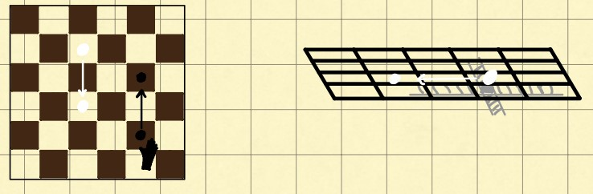
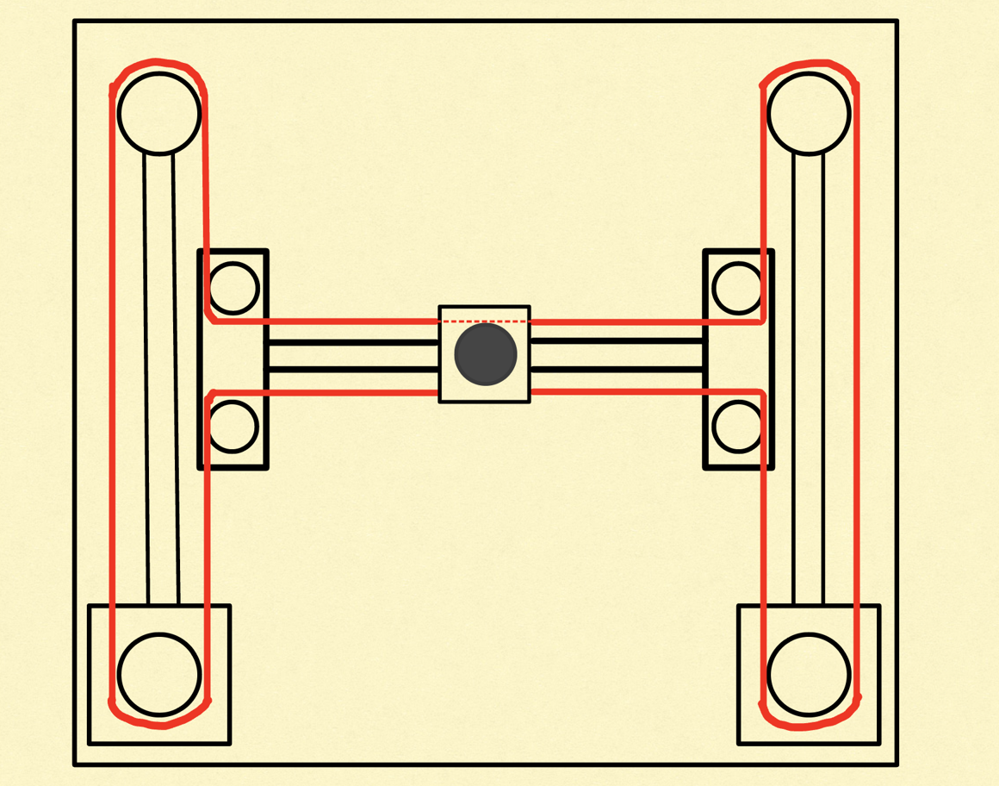
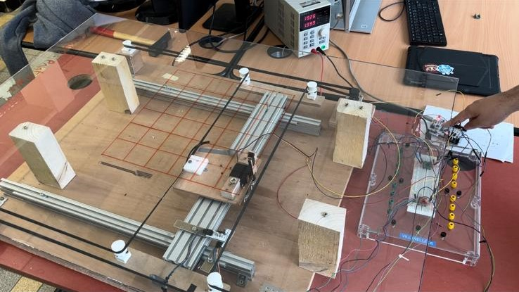
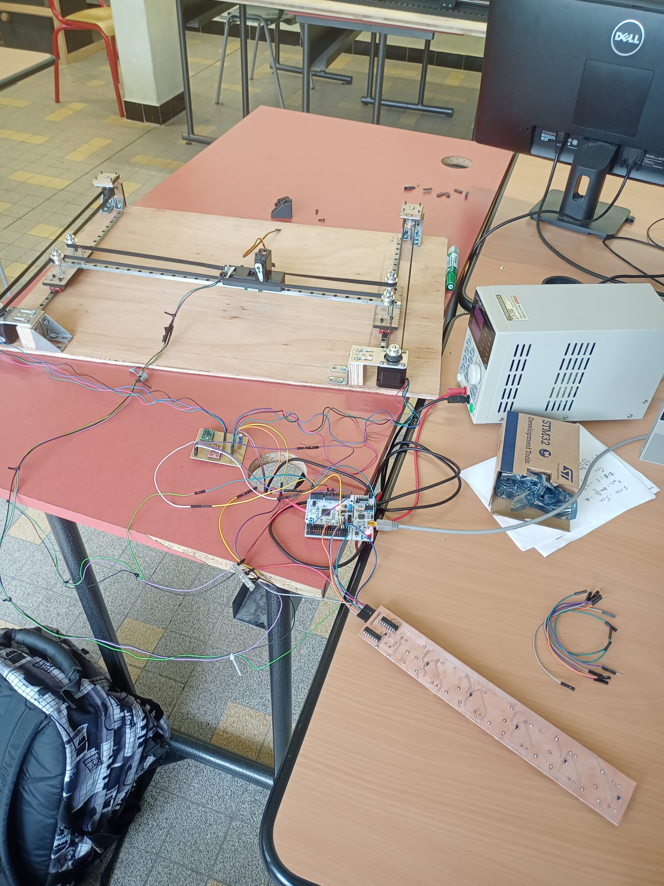
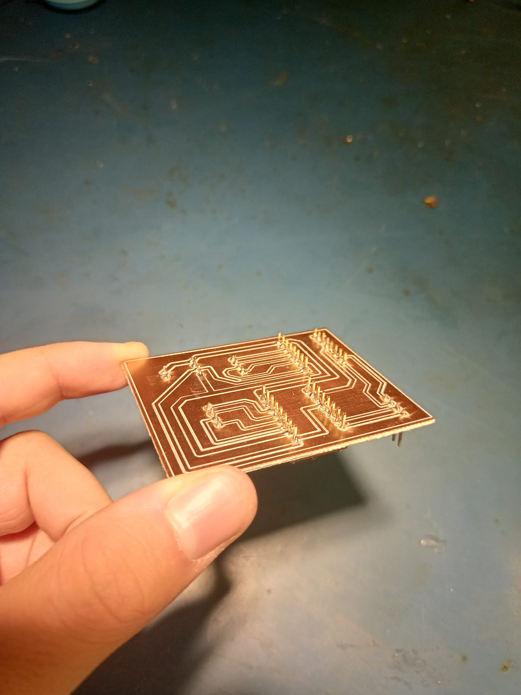
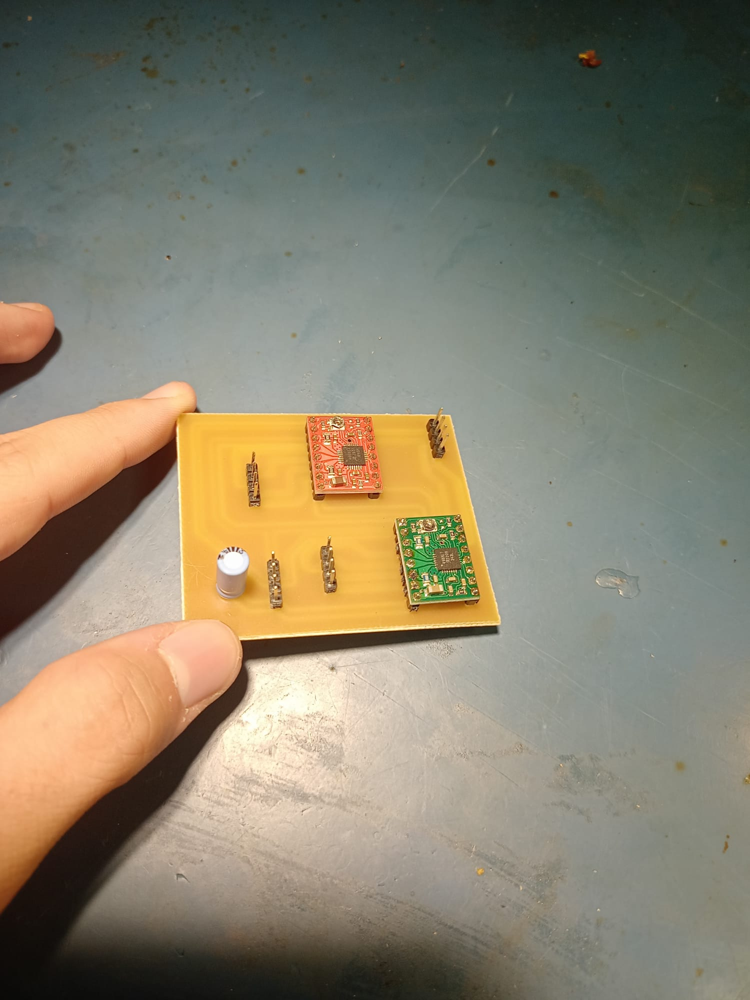
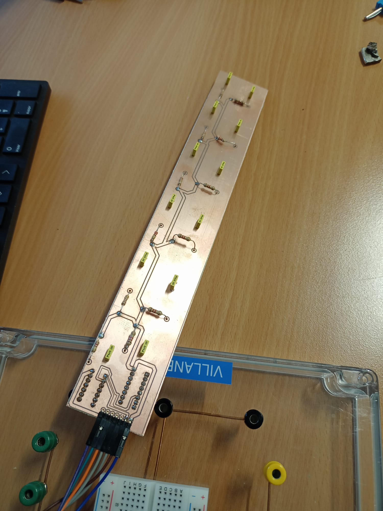
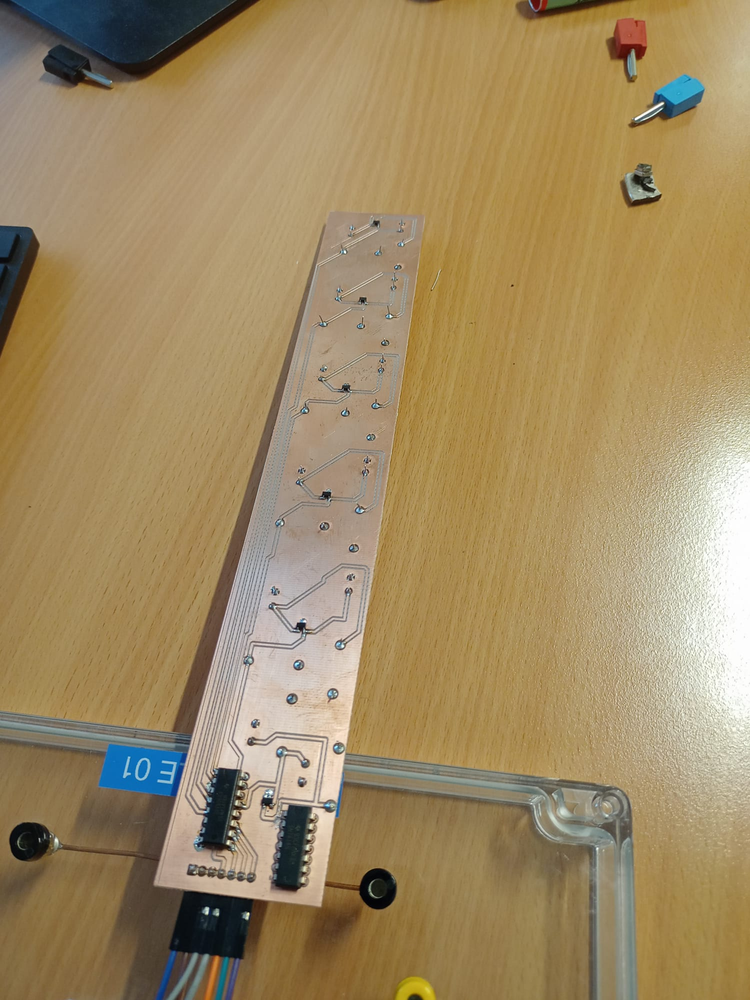

# High-Tech-Chess Project (In Progress)
###### {Polytech Montpellier Third year Project}

Second project of the year, currently in progress and the biggest project I've worked for !

## Introduction

Chess is a game that transcends time. That's why we wanted to innovate by using modern technologies to make the game experience more futuristic. 

What if I tell you that it's possible to play chess from a distance while physically moving pawns. This is currently our goal by making an automatic mechanism which takes in input the XY coordinates and then move the pawn.

here's how the game would be played :

   - The 1st player move his pawn and the system copy the movement in the 2nd player's chessboard.
     
   - After the movement being done, it's the 2nd player's turn, doing the same thing as the 1st player.

## Visuel

  

## More technically

### Board mechanism

For chess pieces, we have pieces with a magnetic disk at the base, easily found in supermarkets or on the Internet. We decided to use this feature and move them with an electromagnet by using electromagnetic force.

So we're going to use a mechanical system that moves along the carthesian plane. We're thinking in terms of a system using stepper motors, pulleys and timing belts, in the same way as CNC systems.

  

As someone who really likes projects needing at the same time elctronics, IT and mechanics (i.e. Mecatronic), I'm very excited to see the final result !

### Pawns detections

We have several tools and ways to detect the presence of the pawn but our first idea is to use Hall effect sensors which detects the presence of the pawn thanks to theirs base's magnet disk.

### The Microcontroller

To control all of this stuff, it'll be necessary to use a Microcontroller. We first thought of using an Arduino but we would like to change of µC because most of our last projects were including an Arduino, we want to discover something else. 

As we're learning a lot about the nucleo board from STM in our µC class, we would like to use it at the end of our project. But we need to be effective because we have a time constraint, so we decided to temporarily use the Arduino board for the tests.

## Features

At the end of our project, the High Tech Chess board will be able of :

- Determine the position of the pieces to be moved.
- From the start and finish coordinates, find the shortest path, avoiding the other pieces.
- Move eliminated pieces to one side of the board.
- Send and receive data over a network for remote play.
- Report all movements using a graphical interface.

**Stay tuned for further project updates !**

 
 

## 

 
 

Review of the 1st prototype
===========================================================

For 3 months, we worked on various aspects of our project and were able to make a few observations.

  

### Board mechanism

As this is not our core business, we found it very difficult to create a fluid, solid and reliable mechanical system. Indeed, our system had certain imperfections, such as :

- Movement with deviations.
- A belt that wasn't tight enough (the belt therefore wasn't taking all the motor's steps).
- Very fragile pulleys, which were 3D printed.

  

### Pawns detections and movement

We thought using an electromagnet to move the pawns but it turned out to be a bad idea because the pawn base's diameter is too short to close the electromagnet's field. Instead, we'll be using a simple magnet which gives more power to attract the pawns. 

### The Microcontroller

As planned from the very beginning, we performed the first tests (stepper motors and servomotor) on the Arduino development board, then wrote the function libraries directly on the STM32 board. 

In the end, the migration to STM32 proved to be an interesting choice, not only because we were able to put our knowledge into practice, but also because we were faster and more reactive. Indeed, the STM's processor frequency is much higher than the Arduino's (48 MHz for the STM32 board vs. 64kHz for the Arduino board).

In terms of code, our program can :

- Move a given number of squares in one direction.
- Go from point A to point B (only if the destination square is empty).
- Display and update the chessboard.
- Detect the interruption of the push buttons when reseting the system position's.

### To sum up

This prototype has a lot of mechanical issues, so we decided to put more efforts into the developpment of a 2nd prototype. This one will fix those issues and make it more reliable, lighter and more compact.

At this stage of the project, we're starting to have a lot of wires, so we're planning to do a PCB to make it cleaner. 

We made a lot of mistakes during the developpment of the first prototype but that's part of the process ! 

 
 

## 

 
 

Review of the 2nd prototype
===========================================================

For the last month, we designed a second prototype which (in theory) will fix the issues encountered on the first prototype.

  

### Board mechanism

This time, we made the mechanism more quickly and fix some issues but unfortunately, we've run into others issues such as :

- A bad quality of the ball bearing carriages.
- A belt that still wasn't tight enough (the belt therefore wasn't taking all the motor's steps).

However, since the beginning, we've been using a breadboard to link our peripherals to our microcontroller, which is no longer comfortable when we have a lot of cables. So we designed a PCB that makes our workspace cleaner.

  
  

### Pawns detections

As soon as we received our hall-effect sensors, we were able to test them and design a PCB. Due to a lack of time, we designed a PCB that recovers the state of each sensor on a single line of our chessboard.

Actually, we used demultiplexors to recover the state of a sensor : one which choose the sensor per line and one who select the line.

  
  

### The Microcontroller

We added some functions to perform the detection through the hall effect sensors. The state of all of the sensors is displayed on a table. It would be interesting to use DMA for making the printing into console more fast and to allow the processor to do something else.

## To sum up

This prototype fixed the previous issues but still have some. Unfortunately, in the rush, we forgot to record a video of the demo.

Finally, if we were to continue this project, our objective would be to:

- Add the Enable pin to the motor drivers to enable them only when we have to move and thus avoid overheating of the motors.
- Design a shield-shaped PCB on our board to make modifications more flexible.
- Avoid lateral play of the main rail by using a T-shaped lateral structure connected to the main rail.
- Replace the demultiplexors with an I2C bus port expansion card.

At the end of this project, we've had a lot of mechanical constraints, but we've also become aware of how difficult it is to manage time. However, this project was full of interesting subjects and we learned so much things !

We'll get back stronger :)

 

_ZAKANI-FADILI Bilel - ASSET Guilhem - AUBERTIN Michael_
